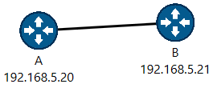
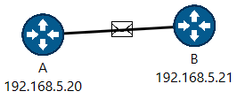

# Web Packet Simulator
 
Web Packet Simulator is a program that simulates packet travelling from source to destination device.

It can:
- create a router

- connect two routers

- send a packet from source to destination router

